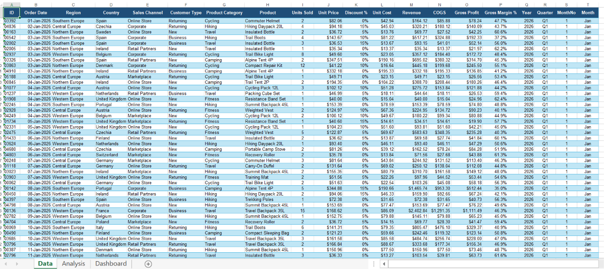
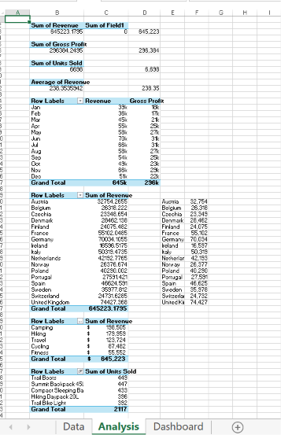
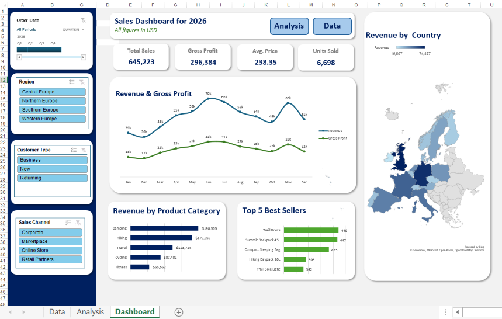

## Project Overview

This project is an **interactive sales analysis and dashboard built entirely in Microsoft Excel**.

The goal of the project was to take raw sales data in an excel file, 
* Analyze the data
* Identify useful business insights
* Turn the results into an interactive dashboard that can be used by stakeholders to understand sales performance.

I structured the workbook into separate **Data, Analysis, and Dashboard** sections instead of simply creating charts from a dataset and this allowed me to keep the raw data organized and then perform detailed analysis separately, and then use the results to build a clean dashboard for reporting and decision-making.

I used this project to demonstrate my ability to use Excel for basic spreadsheets, and also as a **data analysis and business intelligence tool**.

The dashboard allows users to explore sales performance by areas such as:

* Region
* Country
* Sales Channel
* Customer Type
* Product Category
* Product
* Monthly performance
* Revenue
* Gross Profit
* Units Sold
* Average Price

The final dashboard is designed to make it easier for a manager, business owner, or sales team to answer these key questions that guide the general KPIs:

> **How much revenue did we generate?**

> **How profitable were our sales?**

> **Which products are selling the most?**

> **Which product categories generate the most revenue?**

> **Which countries are contributing the most to sales?**

> **How did sales change throughout the year?**

> **Which customer and sales segments should receive more attention?**

---

# Project Objective

The main objective of this project was to demonstrate an end-to-end **Excel data analysis and dashboard development workflow**.

When working on this project, I wanted to move beyond simply calculating totals on excel and instead create a solution that could:

1. Organize raw sales data.
2. Create calculated business metrics.
3. Analyze sales performance from different perspectives.
4. Identify trends and high-performing segments.
5. Present the results visually.
6. Allow users to interact with the analysis.
7. Make the information easy for a non-technical user to understand.

The project focus was on both **technical Excel skills** and **business-focused data storytelling**.

---

# Workbook Structure

The excel workbook is divided into three main sections.

```text
Interactive Excel Sales Dashboard.xlsx
│
├── Data
│   └── Raw and calculated sales data
│
├── Analysis
│   └── KPIs, PivotTables and supporting analysis
│
└── Dashboard
    └── Interactive visual dashboard
```

This structure separates the data preparation, analytical work, and final presentation.

---

# 1. Data Sheet


The **Data** sheet contains the underlying sales dataset used throughout the project.

The dataset contains:

* **2,707 sales records**
* **20 columns**
* Sales transactions covering **2026**
* Data from **17 countries**
* **4 regions**
* **4 sales channels**
* **3 customer types**
* **5 product categories**
* **20 individual products**

The data is stored in an Excel Table called:

```text
SalesDataTable
```

Using an Excel Table makes the dataset easier to manage and allows formulas and references to automatically work with the table structure.

---

## Data Fields

The dataset contains the following fields:

| Field            | Description                             |
| ---------------- | --------------------------------------- |
| ID               | Unique identifier for the sales record  |
| Order Date       | Date the order was placed               |
| Region           | Geographic region                       |
| Country          | Country where the sale occurred         |
| Sales Channel    | Channel through which the sale was made |
| Customer Type    | Type of customer                        |
| Product Category | Main category of the product            |
| Product          | Specific product sold                   |
| Units Sold       | Number of units sold                    |
| Unit Price       | Selling price per unit                  |
| Discount %       | Discount applied to the sale            |
| Unit Cost        | Cost of one unit                        |
| Revenue          | Revenue generated from the transaction  |
| COGS             | Cost of goods sold                      |
| Gross Profit     | Revenue after COGS                      |
| Gross Margin %   | Gross profit as a percentage of revenue |
| Year             | Year extracted from the order date      |
| Quarter          | Quarter extracted from the order date   |
| MonthNo          | Numeric month                           |
| Month            | Month name                              |

---

# Calculated Fields

One of the important parts of this project was creating calculated fields from the original sales information.

Instead of relying only on the fields already provided, I used Excel formulas to derive additional business metrics.

### Revenue

Revenue is calculated using:

```excel
=Units Sold * Unit Price * (1 - Discount %)
```

In the workbook, the formula is:

```excel
=I2*J2*(1-K2)
```

This accounts for discounts when calculating the actual revenue generated by each transaction.

---

### COGS

Cost of Goods Sold is calculated as:

```excel
=Units Sold * Unit Cost
```

The workbook uses:

```excel
=I2*L2
```

---

### Gross Profit

Gross profit is calculated as:

```excel
=Revenue - COGS
```

The workbook uses:

```excel
=M2-N2
```

---

### Gross Margin %

Gross margin measures how much of the revenue remains after the cost of goods sold.

The calculation is:

```excel
=Gross Profit / Revenue
```

The workbook uses:

```excel
=IFERROR(O2/M2,0)
```

Using `IFERROR` helps prevent errors if a transaction has zero revenue.

---

### Year

The year is extracted from the order date:

```excel
=YEAR(Order Date)
```

---

### Quarter

The quarter is calculated from the month:

```excel
="Q"&ROUNDUP(MONTH(Order Date)/3,0)
```

This allows the data to be analyzed by quarter.

---

### Month Number

The numeric month is extracted using:

```excel
=MONTH(Order Date)
```

This is useful when keeping months in chronological order.

---

### Month

The month name is generated using:

```excel
=TEXT(Order Date,"mmm")
```

This produces values such as:

```text
Jan
Feb
Mar
Apr
...
Dec
```

These calculated fields provide a stronger foundation for the analysis and dashboard.

---

# 2. Analysis Sheet

The **Analysis** sheet is where the main analytical work takes place.


Rather than building the dashboard directly from the raw dataset, I created supporting analysis tables and KPIs first.

This separates the analytical calculations from the visual presentation.

The analysis includes:

* Overall sales KPIs
* Monthly revenue analysis
* Monthly gross profit analysis
* Country revenue analysis
* Product category revenue analysis
* Top-selling product analysis
* Supporting PivotTables

---

# Key Performance Indicators

The analysis produces the following overall KPIs.

| KPI                             |          Result |
| ------------------------------- | --------------: |
| Total Revenue                   | **$645,223.18** |
| Gross Profit                    | **$296,384.25** |
| Units Sold                      |       **6,698** |
| Average Revenue per Transaction |     **$238.35** |

These KPIs provide a quick view of overall business performance.

The dashboard then brings these numbers into a visual format so that they can be understood without going through the analysis tables.

---

# Monthly Revenue and Gross Profit Analysis

The project analyzes revenue and gross profit across all twelve months.

| Month     |    Revenue | Gross Profit |
| --------- | ---------: | -----------: |
| January   | $39,091.82 |   $17,596.94 |
| February  | $35,647.72 |   $16,561.51 |
| March     | $44,696.90 |   $21,465.04 |
| April     | $54,688.64 |   $25,283.65 |
| May       | $58,235.19 |   $27,301.53 |
| June      | $69,504.34 |   $31,109.93 |
| July      | $66,442.24 |   $31,035.09 |
| August    | $57,609.04 |   $27,126.76 |
| September | $53,609.28 |   $25,001.06 |
| October   | $49,147.54 |   $22,793.04 |
| November  | $65,523.64 |   $28,666.87 |
| December  | $51,026.85 |   $22,442.84 |

This analysis makes it possible to see how revenue and gross profit changed throughout the year.

For example, the data shows that **June generated the highest monthly revenue**, at approximately **$69,504**, while February recorded the lowest monthly revenue at approximately **$35,648**.

---

# Revenue by Country

The analysis also breaks revenue down by country.

The dataset contains sales from **17 countries** across Europe.

Some of the largest revenue contributions include:

| Country        |    Revenue |
| -------------- | ---------: |
| United Kingdom | $74,427.37 |
| Germany        | $70,034.11 |
| France         | $55,102.05 |
| Italy          | $50,319.47 |
| Spain          | $46,624.59 |

This analysis provides a geographic view of the business and makes it easier to identify markets that contribute significantly to overall revenue.

---

# Revenue by Product Category

The project also analyzes revenue across five product categories.

| Product Category |     Revenue |
| ---------------- | ----------: |
| Camping          | $198,505.13 |
| Hiking           | $179,959.14 |
| Travel           | $123,724.49 |
| Cycling          |  $87,481.99 |
| Fitness          |  $55,552.43 |

The category analysis shows how different areas of the product portfolio contribute to overall sales.

**Camping** generated the highest revenue among the five categories, followed by **Hiking**.

This type of analysis could help a business evaluate product demand, marketing priorities, inventory planning, and future product opportunities.

---

# Top 5 Best-Selling Products

The workbook also identifies the five products with the highest number of units sold.

| Product              | Units Sold |
| -------------------- | ---------: |
| Trail Boots          |        449 |
| Summit Backpack 45L  |        447 |
| Compact Sleeping Bag |        433 |
| Hiking Daypack 20L   |        396 |
| Trail Bike Light     |        392 |

This provides another perspective on performance.

Revenue tells us which categories or markets generate money, while units sold helps identify products with strong sales volume.

---

# 3. Dashboard

The **Dashboard** sheet is the final presentation layer of the project.


The goal was to transform the analysis into a simple interface that allows a user to understand the business without having to work through the underlying calculations.

The dashboard includes:

### KPI Cards

* Total Sales
* Gross Profit
* Units Sold
* Average Price

### Visualizations

* Revenue & Gross Profit over time
* Revenue by Product Category
* Top 5 Best Sellers
* Revenue by Country using a geographic map

### Interactive Filters

* Region
* Customer Type
* Sales Channel

The dashboard is designed to allow users to filter the information and explore different parts of the business.

---

# 🎛️ Interactive Slicers

One of the features I focused on was making the dashboard interactive.

The dashboard contains slicers for:

### Region

Users can filter the dashboard based on geographic region:

* Central Europe
* Northern Europe
* Southern Europe
* Western Europe

### Customer Type

Users can compare:

* New customers
* Returning customers
* Business customers

### Sales Channel

Users can analyze:

* Online Store
* Marketplace
* Retail Partners
* Corporate

This allows a user to move from a high-level view of the business to a more specific segment without manually changing formulas or rebuilding charts.

---

# Revenue & Gross Profit Trend

The dashboard includes a line chart showing:

* Monthly Revenue
* Monthly Gross Profit

This visualization helps identify changes in performance throughout the year.

It allows a user to quickly see periods of stronger or weaker performance and compare revenue against gross profit at the same time.

---

# Revenue by Product Category

The dashboard contains a visual comparison of revenue across:

* Camping
* Hiking
* Travel
* Cycling
* Fitness

This makes it easy to identify which product categories contribute the most to total revenue.

---

# Top 5 Best Sellers

The dashboard also highlights the five products with the highest unit sales.

This gives the user a quick view of the products generating the strongest sales volume.

Instead of having to scan a large product table, the most important products are immediately visible.

---

# Revenue by Country

The dashboard includes a geographic visualization showing revenue across the countries included in the dataset.

This provides a different way of looking at the data compared with traditional charts.

It helps answer questions such as:

* Where are sales concentrated?
* Which countries contribute significant revenue?
* How is revenue distributed geographically?

---

# Excel Skills Demonstrated

This project demonstrates several Excel skills that are useful in **Data Analytics, Business Intelligence, Reporting, and Business Analysis** roles.

### Data Management

* Excel Tables
* Structured references
* Data organization
* Data types
* Date fields
* Calculated columns

### Excel Formulas

I used formulas to create business metrics including:

```text
Revenue
COGS
Gross Profit
Gross Margin %
Year
Quarter
Month Number
Month
```

Key functions include:

```excel
IFERROR()
YEAR()
MONTH()
ROUNDUP()
TEXT()
```

---

### PivotTables

PivotTables were used to summarize the sales data from different perspectives.

Examples include:

* Monthly revenue
* Monthly gross profit
* Revenue by country
* Revenue by product category
* Units sold by product

This allowed the raw transaction-level data to be transformed into useful summaries.

---

### PivotCharts

The dashboard uses charts connected to the analysis.

This creates a clear separation between:

```text
Raw Data
     ↓
Analysis
     ↓
Visualizations
     ↓
Dashboard
```

---

### Slicers

I used Excel slicers to make the dashboard interactive.

The slicers allow users to filter the dashboard by:

```text
Region
Customer Type
Sales Channel
```

---

### Excel Map Visualization

The dashboard also uses a geographic map to visualize revenue by country.

This provides a more intuitive way to understand geographic sales performance.

---

### Dashboard Design

I also focused on presenting the information in a way that is easy to read.

The dashboard includes:

* KPI cards
* Consistent visual structure
* Clear chart titles
* Supporting analysis
* Interactive filters
* Geographic visualization
* Separation between analysis and presentation

---

# My Analysis Workflow

The project followed an end-to-end process.

```text
Raw Sales Data
       ↓
Data Organization
       ↓
Calculated Fields
       ↓
KPI Calculations
       ↓
PivotTable Analysis
       ↓
Trend Analysis
       ↓
Category Analysis
       ↓
Country Analysis
       ↓
Product Analysis
       ↓
Interactive Dashboard
       ↓
Business Insights
```

This workflow is important because a good dashboard should not start with charts.

The first step should be understanding the data and deciding what business questions need to be answered.

---

# Key Insights

The analysis produced several useful observations.

### 1. Strong overall revenue performance

The dataset generated approximately:

**$645K in total revenue**

with approximately:

**$296K in gross profit.**

This gives an overall view of both sales volume and profitability.

---

### 2. June was the strongest revenue month

June generated approximately:

**$69,504 in revenue**

making it the highest-revenue month in the dataset.

July was also strong, with approximately **$66,442** in revenue.

---

### 3. Camping generated the most revenue

Camping generated approximately:

**$198,505**

in revenue.

Hiking followed with approximately:

**$179,959**.

Together, these two categories represented a large part of total revenue.

---

### 4. The United Kingdom was the largest country by revenue

The United Kingdom generated approximately:

**$74,427**

in revenue, followed by Germany at approximately:

**$70,034**.

This provides a clear geographic view of where significant sales are coming from.

---

### 5. Trail Boots were the top-selling product by units

Trail Boots recorded:

**449 units sold**

followed closely by the Summit Backpack 45L with:

**447 units sold**.

This shows that the products generating high sales volume can be identified separately from the categories generating the most revenue.

---

# Business Questions This Dashboard Can Answer

The dashboard can be used to answer questions such as:

### Sales Performance

* What is our total revenue?
* How much gross profit did we generate?
* How many units did we sell?
* What is the average revenue per transaction?

### Time Trends

* Which month had the highest revenue?
* Which months experienced weaker sales?
* How does gross profit move alongside revenue?

### Geographic Performance

* Which countries generate the most revenue?
* How does performance differ across regions?
* Where are our strongest markets?

### Product Performance

* Which product categories generate the most revenue?
* Which products sell the most units?
* Are high-volume products also contributing significantly to revenue?

### Customer and Channel Analysis

* How does performance differ by customer type?
* Which sales channels contribute most to revenue?
* How does performance change when a specific region or customer segment is selected?

---

# Technical Implementation

One of the things I wanted to demonstrate with this project was that Excel can be used as more than a basic spreadsheet.

The workbook combines several Excel features into one analytical workflow:

```text
Excel Table
    +
Calculated Columns
    +
Excel Formulas
    +
PivotTables
    +
PivotCharts
    +
Slicers
    +
Map Visualization
    +
Dashboard Design
```

The result is an interactive reporting tool built within Excel.

---

# Why I Built the Analysis and Dashboard Separately

I intentionally separated the **Analysis** sheet from the **Dashboard** sheet.

The Analysis sheet contains the supporting calculations and summaries, while the Dashboard focuses on communicating the results.

This approach has several advantages:

* Keeps the dashboard clean
* Makes calculations easier to audit
* Makes troubleshooting easier
* Separates data from presentation
* Makes the workbook easier to maintain
* Allows the dashboard to focus on decision-making

This is also closer to how analytical reporting is structured in real-world business environments.

---
